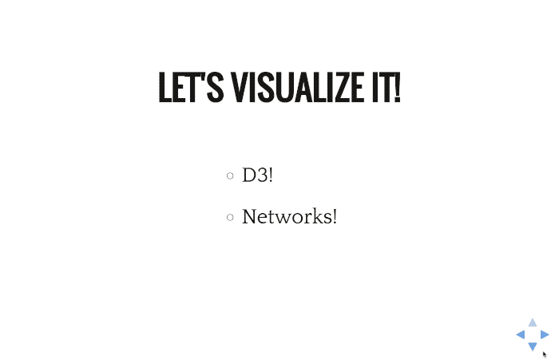

# RevealVizScroll

A Reveal.js plugin for faking visualization scrollyteling. It lets you create incremental visualizations that stay on the screen between slides, like this one

  
http://johnguerra.co/slides/untanglingTheHairball

## Usage

1) Create your typical reveal.js presentation, then include revealVizScroll.css and d3.v4.js
```html
<html>
  <head>
    <link rel="stylesheet" href="css/reveal.css">
    <link rel="stylesheet" href="css/theme/white.css">
    <link rel="stylesheet" href="css/revealVizScroll.css">
    <!-- Other headers -->
  </head>
  <body>
    <!-- reveal sections -->

    <script src="js/head.min.js"></script>
    <script src="js/reveal.js"></script>
    <script src="js/d3.v4.min.js"></script>

    <!-- reveal initialize and other scripts -->
  </body>
</html>
```
2) Add the library revealVizScroll.js to Reveal.js dependencies, with a callback that creates your scrollables. To create a scrollable use the function `revealVizScroll.makeScrollable(name, stepFunction, [initFunction, [stopFunction]])`. Name is the same name you will use in the scrollable attribute of your slides, stepFunction gets called everytime your slides changed with a parameter identifying the step. The last two parameters correspond to the functions called on init (once at the beginning of your presentation) and on stop (evertime the slides move away of your scrollable).
```html
    <script>
      function moveLeft(ele) {
        d3.select(ele)
          .select("circle")
          .transition()
          .duration(1000)
            .attr("cx", 100);
      }

      function moveRight(ele) {
        d3.select(ele)
          .select("circle")
          .transition()
          .duration(1000)
            .attr("cx", 300);
      }

      function doStep(step) {
        if (step==="step 0") moveLeft(this);
        else if (step==="step 1") moveRight(this);
      }

    </script>
    <script>
      Reveal.initialize({
        dependencies: [
          { src : "js/revealVizScroll.js",
            async: false,
            callback: function () {
              revealVizScroll.makeScrollable("demo", doStep);
            }
          }
        ],

      });
    </script>
```

3) Add the *scroll* class to the sections you want to scroll, with two additional attributes *scrollable* with an id of the viz, and step with the id of the step.

```html
    <div class="reveal">
      <div class="slides">
        <section>
          <section>
            <h1>No scrolling slide</h1>
          </section>
          <section class="scroll" scrollable="demo" step="step 0" >
            <h2>Scrolling slide step 0</h2>
          </section>
          <section class="scroll" scrollable="demo" step="step 1" >
            <h2>Scrolling slide step 0</h2>
          </section>
        </section>
      </div>
    </div>
```

4) **Optional** If you want add a base code for your visualization as a div with the classes scrollable and scrollable-nameYourViz, where nameYourViz matches the parameter value of scrollable in your sections (e.g. scrollable-demo). If you don't add the placeholder, we'll add it for you, that's how much we like you!

```html
  <div class="reveal">
    <div class="slides">
      <div class="scrollable scrollable-demo">
        <svg width=400 height=400>
          <circle cx=200 cy=200 r=20 style="fill:steelblue"></circle>
        </svg>
      </div>

      <!-- Your slides -->
    </div>
  </div>
```

### Basic Example

```html
<html>
  <head>
    <link rel="stylesheet" href="css/reveal.css">
    <link rel="stylesheet" href="css/theme/white.css">
    <link rel="stylesheet" href="css/revealVizScroll.css">
    <meta name="viewport" content="width=device-width, initial-scale=1.0, maximum-scale=1.0, user-scalable=no, minimal-ui">
  </head>
  <body>
    <div class="reveal">
      <div class="slides">
        <!-- Optional: Placeholder for your scrollable viz -->
        <div class="scrollable scrollable-demo">
          <svg width=400 height=400>
            <circle cx=200 cy=200 r=20 style="fill:steelblue"></circle>
          </svg>
        </div>

        <!-- Your slides -->
        <section>
          <section>
            <h1>No Scrolling</h1>
          </section>
          <section class="scroll" scrollable="demo" step="step 0" >
            <h2>Step 0 text</h2>
          </section>
          <section class="scroll" scrollable="demo" step="step 1" >
            <h2>Step 1 text</h2>
          </section>
          <section>
            <h2>No scrolling again</h2>
          </section>
        </section>
      </div>
    </div>
    <script src="js/head.min.js"></script>
    <script src="js/reveal.js"></script>
    <script src="js/d3.v4.min.js"></script>
    <script>
      function moveLeft(ele) {
        d3.select(ele)
          .select("circle")
          .transition()
          .duration(1000)
            .attr("cx", 100);
      }

      function moveRight(ele) {
        d3.select(ele)
          .select("circle")
          .transition()
          .duration(1000)
            .attr("cx", 300);
      }

      function doStep(step) {
        if (step==="step 0") moveLeft(this);
        else if (step==="step 1") moveRight(this);
      }

    </script>
    <script>
      Reveal.initialize({
        dependencies: [
          { src : "js/revealVizScroll.js",
            async: false,
            callback: function () {
              revealVizScroll.makeScrollable("demo", doStep);
            }
          }
        ],

      });
    </script>
  </body>
</html>
```

### Fuller example

Check the [examples](https://github.com/john-guerra/revealVizScrollyteling/tree/master/examples) folder ([running demo](https://john-guerra.github.io/revealVizScrollyteling/examples/)).
